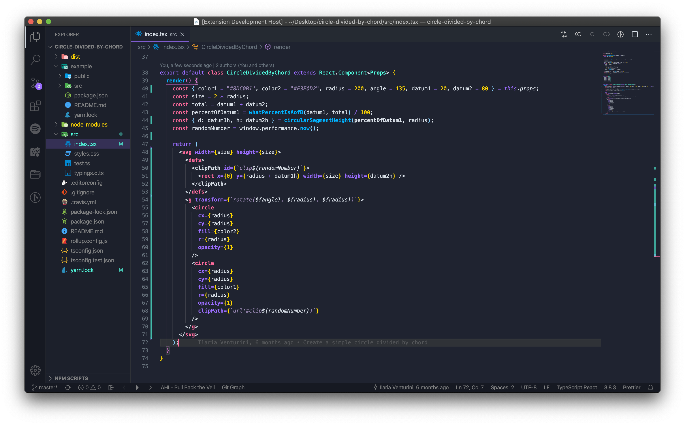
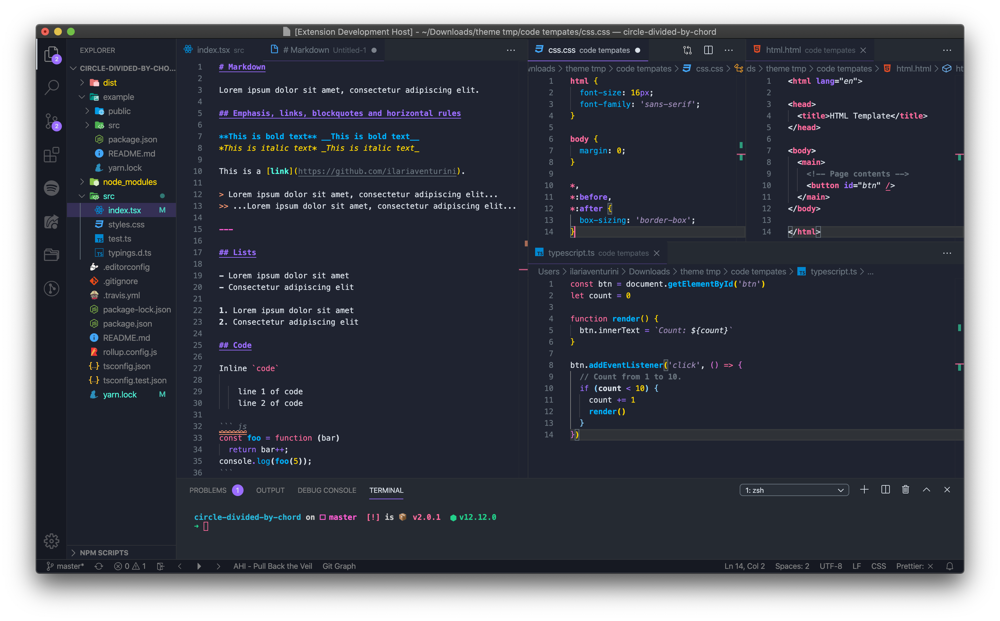
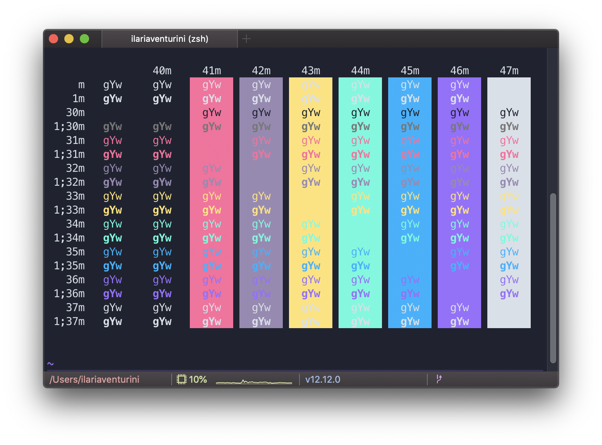
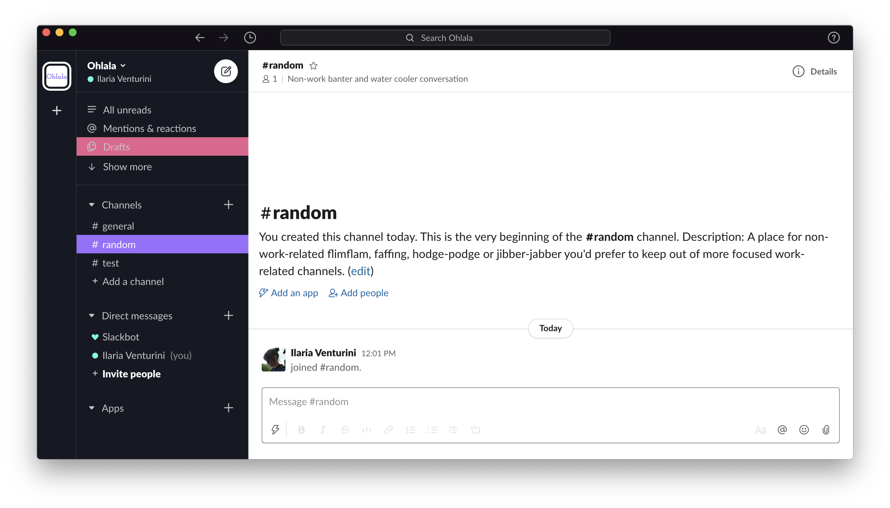
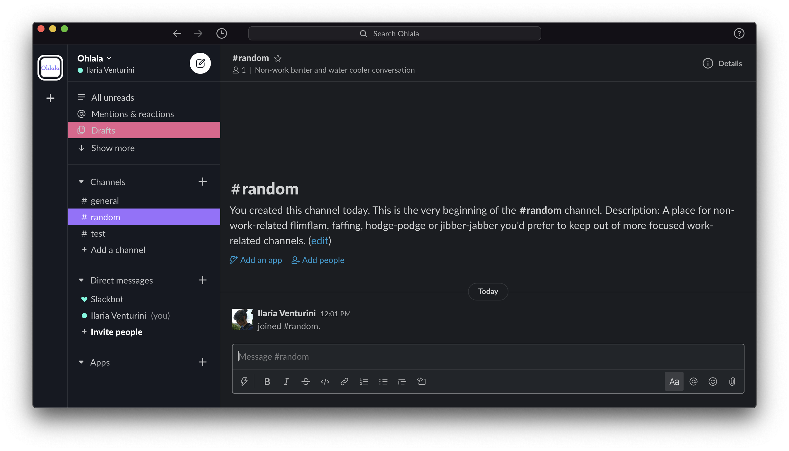

  

  🌈 A fresh dark theme for [VS Code](https://code.visualstudio.com/), [iTerm](https://www.iterm2.com/) and [Slack](https://slack.com/).

---

# VS Code

1. Open the **Extensions** sidebar
2. Search for `Ohlala theme`
3. Click on **Install**
4. Open the **Command Palette** with `Ctrl+Shift+P` or `⇧ ⌘ P` or go to `View → Command Palette...`
5. Select **Preferences: Color Theme** and choose `Ohlala theme`.

For more detail go to the [ohlala-vscode repository](https://github.com/ilariaventurini/ohlala-vscode).

---

# iTerm

1. Go to `iTerm2 → Preferences` then `Profiles → Colors` tab
2. Click on`Load Presets...`
3. Click `Import...`
4. Select the [`ohlala.itermcolors`](ohlala.itermcolors) file
5. Select the `ohlala` theme from `Load Presets...`.

---

# Slack

1. Click on your workspace name and click on `Preferences`
2. Select `Sidebar`
3. Click the `customize your theme and share it with others` link
4. Paste `#161922,#2F3237,#9B6DFF,#FFFFFF,#E6608D,#FFFFFF,#51FBDE,#00B2FF`
5. Close the edit mode clicking on the `x` button in upper right corner.
