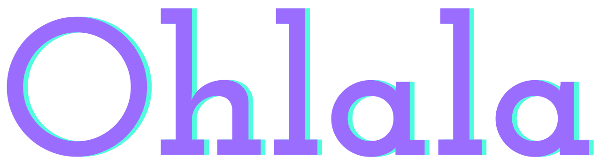
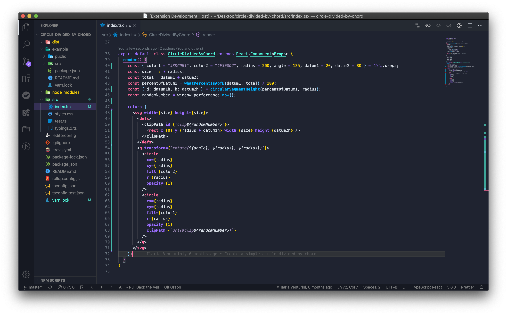
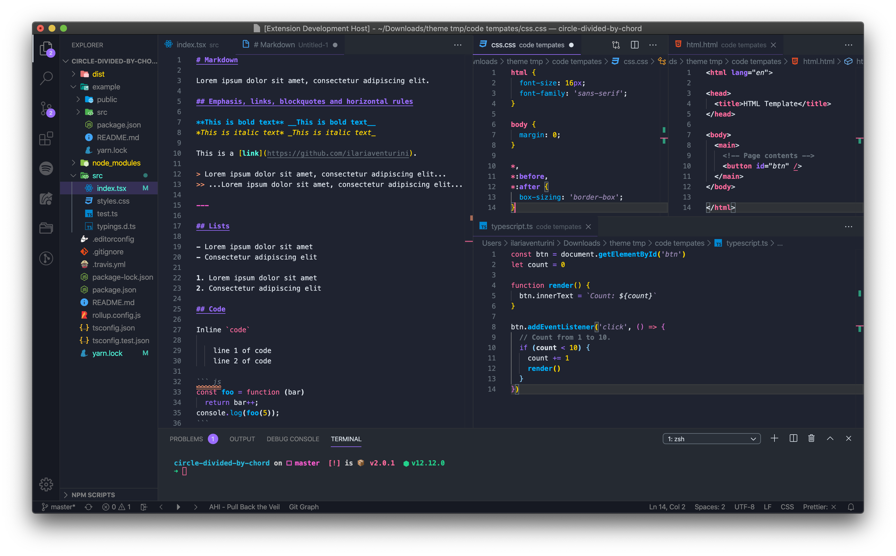
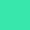
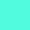
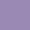
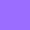
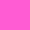

<p align="center">
  <a href="https://github.com/ilariaventurini/ohlala">
    
  </a>
</p>

<center>A fresh dark theme for VS Code.</center><br/>

<p align="center">
  <!-- marketplace version 
  <a href="https://marketplace.visualstudio.com/items?itemName=ilariaventurini.ohlala-theme&ssr=false#overview">
    
  </a>-->
</p>

---

## 🕶 How it looks

**JSX**



**Markdown, CSS, HTML, Typescript/Javascript**



## 🌈 Color palette

Main colors:

| Color    | Hex       | RGB             | HSL               | 🎨          |
| :------- | :-------: | :-------------: | :---------------: | :---------: |
| green    | `#37E7AC` | `55, 231, 172`  | `160°, 61%, 56%`  |  |
| cyan     | `#51FBDE` | `81, 251, 222`  | `170°, 51%, 65%`  |  |
| blue     | `#00B2FF` | `0, 178, 255`   | `198°, 100%, 50%` |  |
| purple   | `#9A89B4` | `154, 137, 180` | `264°, 13%, 62%`  |  |
| lavender | `#9B6DFF` | `155, 109, 255` | `259°, 39%, 71%`  |  |
| pink     | `#FF5CD3` | `255, 92, 211`  | `316°, 46%, 68%`  |  |
| rose     | `#FF6B9D` | `255, 107, 157` | `340°, 40%, 71%`  |  |
| orange   | `#FF9970` | `255, 153, 112` | `17°, 38%, 72%`   |  |
| yellow   | `#FED604` | `254, 214, 4`   | `50°, 97%, 51%`   |  |
| gray-01  | `#D9E0E8` | `217, 224, 232` | `212°, 2%, 88%`   |  |
| gray-02  | `#808182` | `128, 129, 130` | `210°, 0%, 51%`   |  |
| gray-09  | `#1F2330` | `31, 35, 48`    | `226°, 21%, 15%`  |  |

## ⚙️ Installation

1. Open the **Extensions** sidebar
2. Search for `Ohlala`
3. Click on **Install**
4. Open the **Command Palette** with `Ctrl+Shift+P` or `⇧ ⌘ P` or go to `View -> Command Palette...`
5. Select **Preferences: Color Theme** and choose `Ohlala`.
6. Enjoy! 🎉

## 🙈 Language support

I develop mainly in *React*, *HTML*, *CSS*, *Javascript* and *Typescript* so for this set of languages, the theme should look pretty good but maybe there be problems for other not tested languages. 👇

## 🐛 Issues & contributing

This theme is still in progress. Anyway, if you open an issue (or a PR), I will be happy :)

## 🐡 Customization

If you don't like something and you want to change it, VS Code allows you to do it easily: just open the **Command Palette** (`Ctrl+Shift+P`) and select **Preferences: Open Settings (JSON)**.\
Now, you can override VS Code's defaults or `Ohlala`'s colors.

Some examples:

- **Contrast colors**: if you want to add borders around items across the UI to increase the contrast:

  <details>
    <summary>Code</summary>

    ```JSON
    "workbench.colorCustomizations": {
      "contrastActiveBorder": "#68737D",
      "contrastBorder": "#68737D"
    }
    ```
  </details>

- **Underline**: if you don't like underline style, you can remove it:

  <details>
    <summary>Code</summary>

    ```JSON
    "editor.tokenColorCustomizations": {
      "textMateRules": [
        {
          "name": "No underline",
          "scope": [
            "markup.error",
            "invalid",
            "invalid.illegal",
            "invalid.deprecated",
            "markup.underline",
            "markup.heading",
            "markup.underline.link",
            "markup.underline.link.image",
            "entity.name.type.class",
            "comment keyword.codetag.notation",
            "comment.block.documentation keyword",
            "comment.block.documentation storage.type.class",
            "entity.name.type",
            "keyword.primitive-datatypes.swift",
            "keyword.type.cs",
            "meta.protocol-list.objc",
            "meta.return-type.objc",
            "source.go storage.type",
            "source.groovy storage.type",
            "source.java storage.type",
            "source.powershell entity.other.attribute-name",
            "storage.class.std.rust",
            "storage.type.attribute.swift",
            "storage.type.c",
            "storage.type.core.rust",
            "storage.type.cs",
            "storage.type.groovy",
            "storage.type.objc",
            "storage.type.php",
            "storage.type.haskell",
            "storage.type.ocaml",
          ],
          "settings": {
            "fontStyle": "normal"
          }
        }
      ]
    }
    ```
  </details>

- **Italics**: the same, if you don't like italics style, you can remove it:

  <details>
    <summary>Code</summary>

    ```JSON
    "editor.tokenColorCustomizations": {
      "textMateRules": [
        {
          "name": "No italics",
          "scope": [
            "markup.error",
            "invalid",
            "invalid.illegal",
            "invalid.deprecated",
            "markup.italic",
            "fenced_code.block.language.markdown",
            "fenced_code.block.language",
            "markup.raw.inner.restructuredtext",
            "markup.fenced_code.block.markdown punctuation.definition.markdown",
            "keyword.expressions-and-types.swift",
            "keyword.other.this",
            "variable.language",
            "variable.language punctuation.definition.variable.php",
            "variable.other.readwrite.instance.ruby",
            "variable.parameter.function.language.special",
            "meta.attribute.src.html",
            "meta.decorator variable.other.readwrite",
            "meta.decorator variable.other.property",
            "string",
            "entity.name.function.target.makefile",
            "entity.name.section.toml",
            "entity.name.tag.yaml",
            "variable.other.key.toml",
          ],
          "settings": {
            "fontStyle": "normal"
          }
        }
      ]
    }
    ```
  </details>

To learn more about scopes, check out the [color theme documentation](https://code.visualstudio.com/api/references/theme-color).

## License

[MIT](https://github.com/ilariaventurini/ohlala/blob/master/vscode/LICENSE) © [Ilaria Venturini](https://github.com/ilariaventurini)
